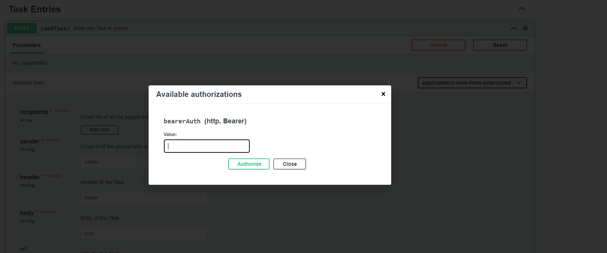

<h2>Swagger Screenshots</h2>

Start the Project
==================================
1. npm init -y
2. npm i mongoose express dotenv
3. Nodemon needs to be installed globally
npm install -g nodemon
4. Create index.js file in the project root dir
5. Inside scripts
"start" : "node index.js",
"dev": "nodemon index.js"
6. Start program using nodemon run dev

Installing swagger
======================================
https://dev.to/kabartolo/how-to-document-an-express-api-with-swagger-ui-and-jsdoc-50do
npm i swagger-ui-express	generates OpenAPI definitions from JSDoc comments.
npm install swagger-jsdoc	creates the Swagger UI page from these definitions.

How to create Swagger Documentation for your project
================================================
Official Doc:
1. OPENAPI3.0: https://swagger.io/docs/specification/basic-structure/
2. OPENAPI2.0: https://swagger.io/docs/specification/2-0/describing-parameters/

Adding JWT Auth to endpoints
==============================================
npm i jsonwebtoken

To add auth for all the endpoints, you can add in swagger.json
security: [{
      jwt: []
}],

To add auth for a particular endpoint, add security: - jwt: [] in the  swagger-jsdoc comment

Express Model Schema Types
================================
https://mongoosejs.com/docs/schematypes.html

Git steps
================================
git init -b main git remote add origin https://github.com/pdhruv93/mongodb-my-tasks.git git add . && git commit -m "initial commit" && git push git push origin main
